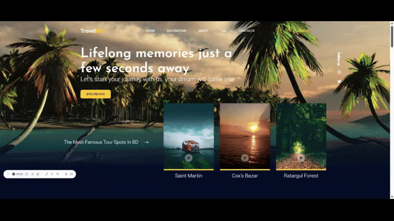
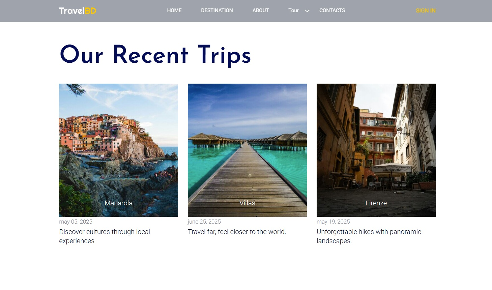
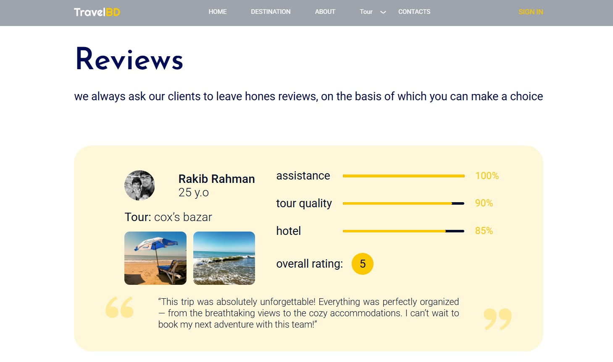

<p align="center">
  
</p>

# 🌍 Travel Landing Page

**Travel Landing** is a modern, responsive landing page designed to showcase travel services and destinations with an engaging and user-friendly interface.

[🌐 Live Demo](https://yuriidano.github.io/travel/)

---

## 📽️ Live Preview



---

## 📸 Screenshots

### 🏠 Home Section


### 🗺️ Recent Trips Section


### 💬 User Reviews Section


### 📧 Footer with Newsletter Subscription


---

## 🚀 Features

- 🌐 Modern responsive design that adapts to all devices  
- 🔄 Smooth navigation with pleasant animations  
- ⚡ Optimized for fast loading and minimal delays  

---

## 🛠️ Tech Stack

- **HTML5** — semantic structure  
- **SCSS** — styling with nested syntax and variables  
- **Flexbox** — for flexible, responsive layouts  
- **BEM Methodology** — for clean and maintainable CSS class naming  
- **JavaScript** — for interactivity and DOM manipulation  

---

## 🌐 SEO & Indexing

- Custom `sitemap.xml` and `robots.txt`  
- Site registered and verified in [Google Search Console](https://search.google.com/search-console)  
- Meta tags for SEO (`title`, `description`, `viewport`)  
- OG tags for social media (`og:title`, `og:image`, `og:description`)  

---

## 📁 Project Structure

project/
├── css/         # Contains all project styles (style.css, style.min.css)
├── js/          # JavaScript logic (animations, DOM interactions, etc.)
├── img/         # Images, icons, and background graphics
├── index.html   # Main HTML file — the landing page entry point

---


---

## 🧪 Running Locally

```bash
git clone https://github.com/yuriidano/travel.git
cd travel
npm install
npm run dev
```


## 🔗 Links

- 🌍 [Live Demo](https://yuriidano.github.io/travel/)
- 📦 [GitHub Repository](https://github.com/yuriidano/travel)

---

> Created by [Yurii Dano](https://github.com/yuriidano).

